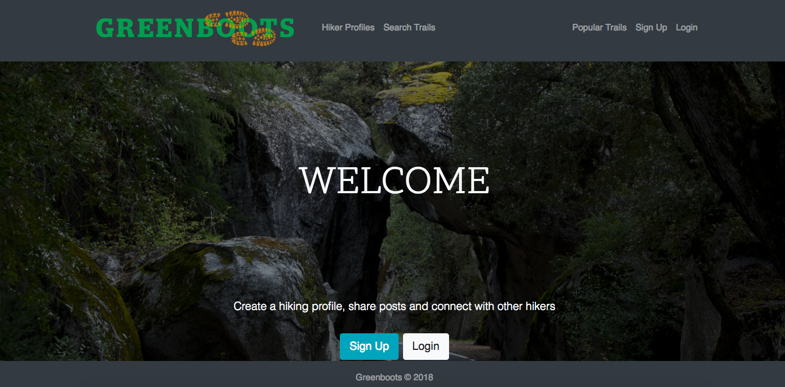
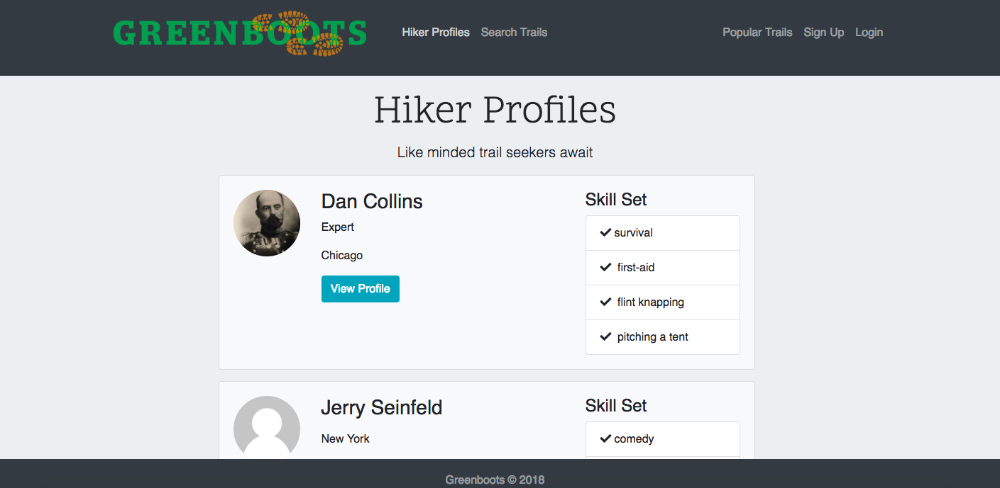

# Greenboots

Greenboots is an application that helps bring the hiking community together, built with React, Redux...( team - add additional items here!!)

## Installation

Clone repository

#### Install dependencies for server
npm install

#### Install dependencies for client
$ npm run client-install

#### Run the client & server with concurrently
$ npm run dev

#### Run the Express server only
$ npm run server

#### Run the React client only
$ npm run client

#### Server runs on http://localhost:5000 and client on http://localhost:3000

## Examples
#### Create a profile

#### Find a new trail

#### Search for a popular trail

## Authors
#### Tom LaChance, Jenny Woulas, Dan Collins, Shari Bratanch

